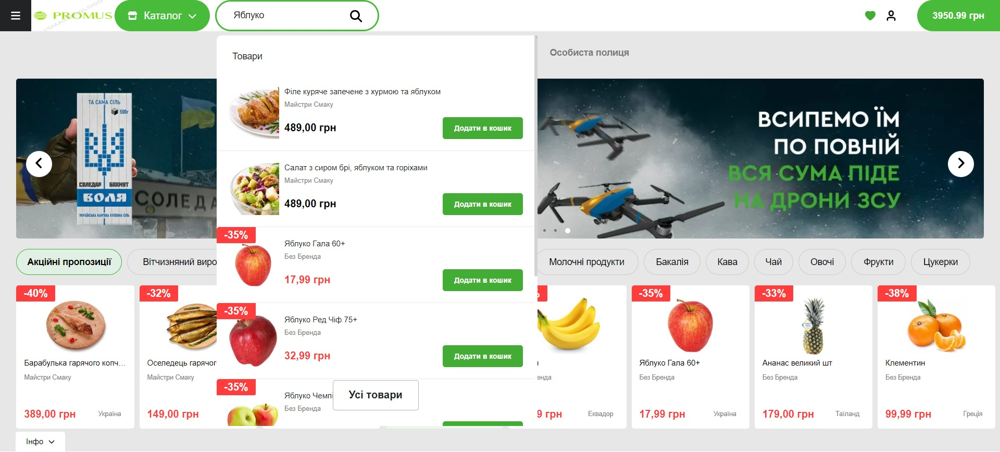

# **Promus - online grocery-store**
## Description


Our project, an online grocery store built with Asp.Net Core MVC, offers users a convenient platform to browse and purchase groceries.
With a seamless user experience, customers can easily select products, create a shopping cart, and manage their account settings.

**Key features include:**

+ **Product Selection:** Users can browse through a wide range of grocery items and view detailed descriptions on individual product pages.

+ **Shopping Cart:** Customers can add items to their shopping cart dynamically, adjusting quantities as needed before proceeding to checkout.

+ **Account Creation:** Users have the option to create an account, allowing for personalized shopping experiences and the ability to save favorite products.

+ **Account Customization:** Registered users can customize their account settings.

+ **Favorite Products:** Logged-in users can add items to their favorites list for quick access during future shopping sessions.

+ **Dynamic Cart Management:** The shopping cart adapts dynamically based on user actions, ensuring a smooth and intuitive shopping experience.

+ **Cookie-Based Data Storage:** For non-registered users, necessary data is stored in cookies, allowing for seamless shopping sessions without the need for account creation.

+ **Database Integration:** When users log in to their account, all data is securely stored in the database, ensuring reliability and consistency across sessions.

+ **Category and Subcategory Sorting:** The platform offers categorized and subcategorized products, allowing users to easily sort and find items based on their preferences.

+ With a visually appealing design crafted exclusively using CSS and HTML, our project prioritizes aesthetics without compromising functionality. Additionally, registered users can save their shopping carts and make edits for future orders, enhancing the overall convenience of the shopping experience.

# Installation

## 1. Clone the Repository:
```
git clone https://github.com/j0zeff/online-grocery-store.git

```
## 2. Navigate to the Project Directory:
```

cd your-project-directory
```

## 3. Update appsettings.json file:
Open the appsettings.json file and add the following connection string to connect to the database:
```
Set this string to your connection string in appsettings.json"Serv+er=aws.con+nect.psdb.cloud;Database=stored+b;user=5yvelu02tsnump11f70r;+password=pscale_pw_rYjHsAwMJRSS9R0AJUHTgJ0i8aOmjOaul5IIYF8d0PU;SslMode=VerifyFull;"
```

## 4. Install Dependencies:
Ensure you have .NET Core SDK installed. Then, restore the project dependencies using:
```

dotnet restore
```

## 5. Run the Application:
```

dotnet run
```

# Technologies Used:
+ **.NET**
  + **Asp.Net Core MVC**
  + **C#**
  + **Entity Framework**
  + **Identity Framework**
  + **Razor Pages**
  +  **Razor View**
  +  **Cookies**
  +  **Caching data (MemoryCache)**
+ JS
  + **JQuery**
  + **Ajax**
  + **Fetch**
  + **Cookies**
+ MySql
+ **CSS**
+ **HTML**


# Examples
## Here you can see some pages from our Application:
Promus Main Page:


Catalog with categories of products


You can also add products to your cart and manage it.


Here you can also use dynamic product-search

 

If you will choose some category from catalog you can see subcategories from choosen category


Then you can choose subcategory and see all products from choosen subcategory.
Here you can sort and find all products you need.


If you need some description of product, you can go to product page:


For getting more options in our Store you should create your account, confirm your email, and loged-in:

 

After that, you can save your cart to buy products next time more quickly and easier.

 

Also, you can add products to your favorite list:

 

And you can see all your saved carts:

 

If you click on one of them you can edit it:

 

And of course, you can change your personal data:


 


